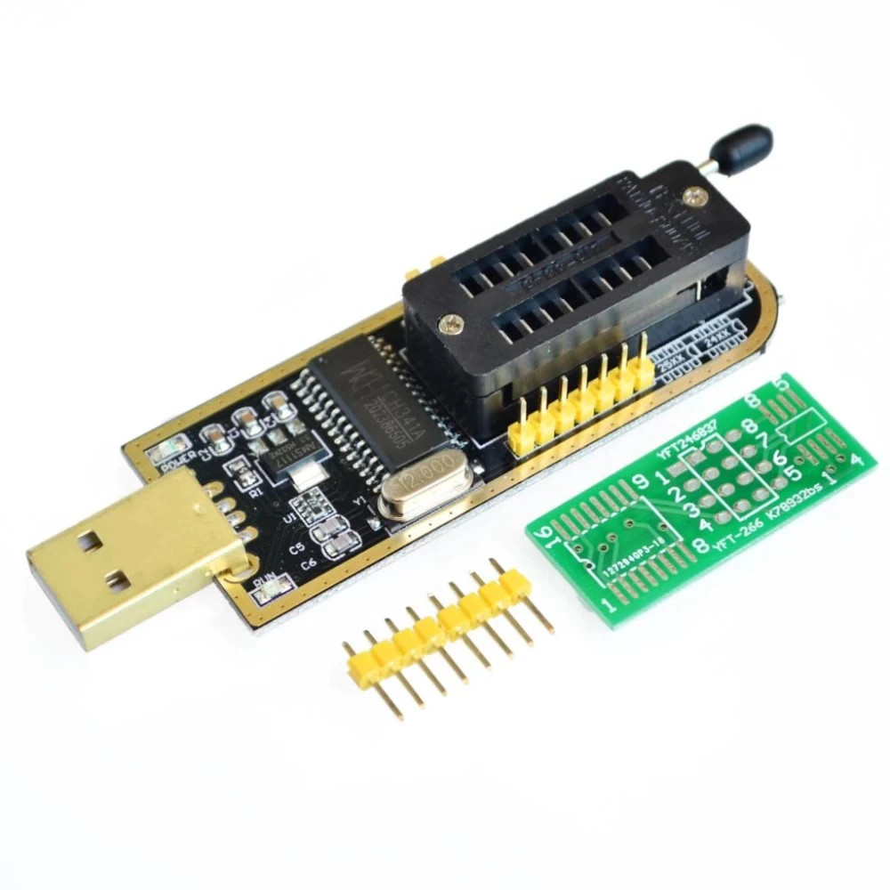
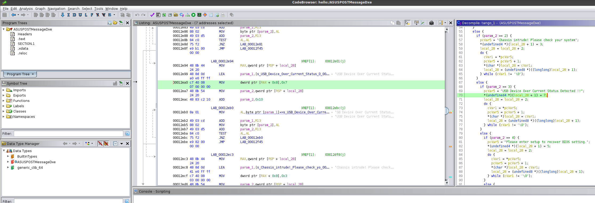
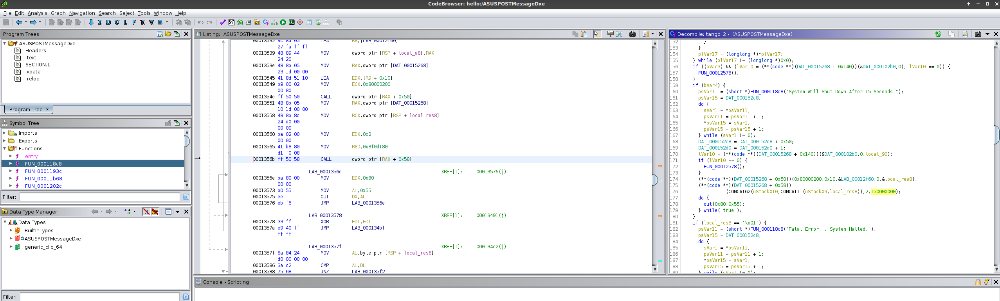
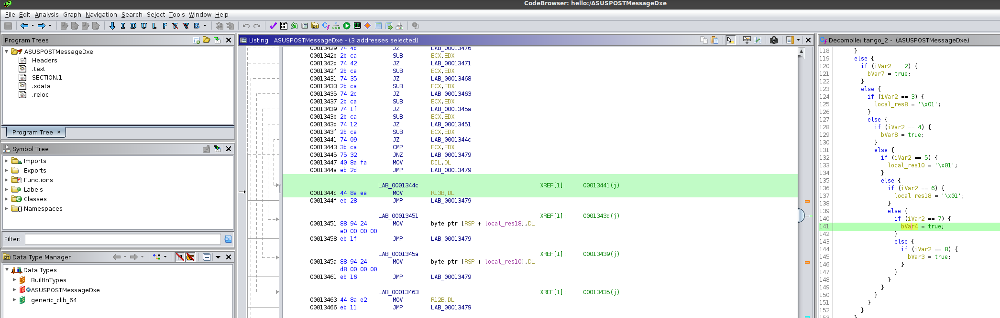
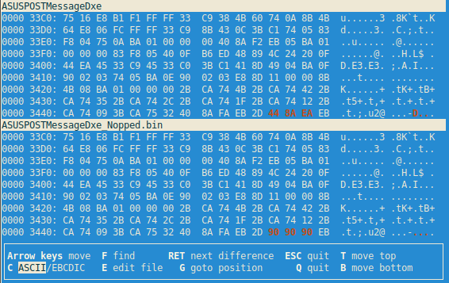
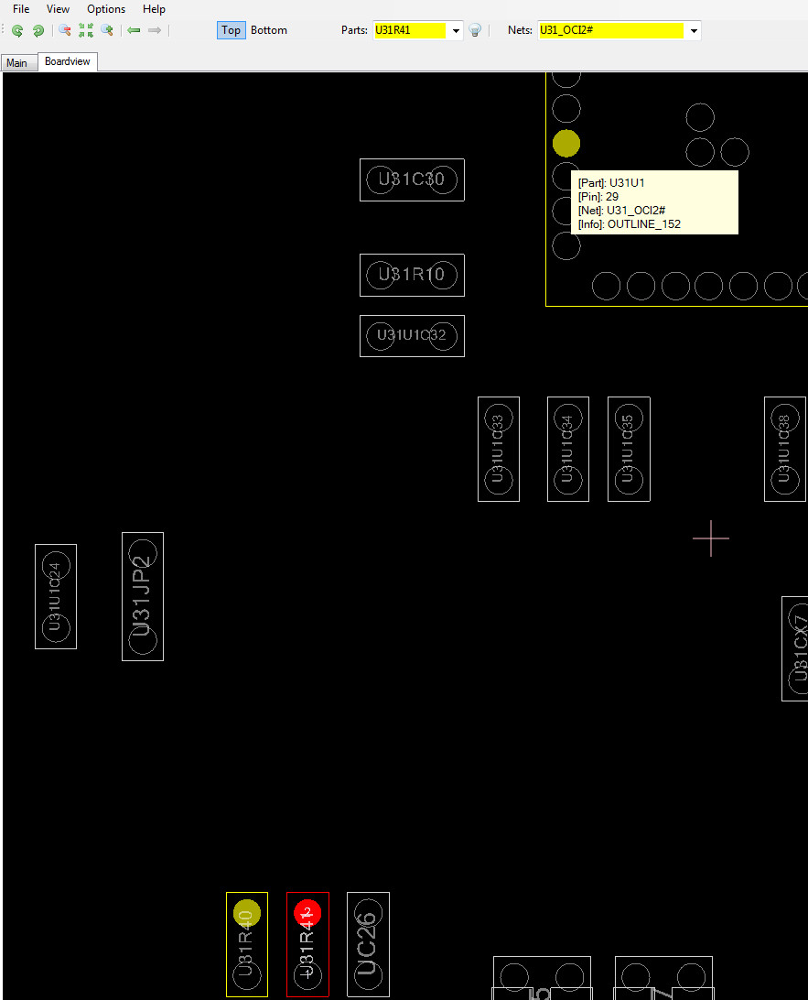

### UEFI BIOS Hacking Notes

I started my Desktop System after a couple of weeks, and found that the ASUS
Z170-AR 1.03 motherboard was failing to POST successfully with the following
error message:

```
USB Device Over Current Status Detected !!
System Will Shut Down After 15 Seconds.
```

**(November-2020)**: After downloading the `BoardView file` for a *similar*
motherboard, I learned about the various OC (over current) detection
sub-circuits present on the motherboard. I systematically checked the reference
voltages present at all (4) of those voltage dividers and found them to be
3.26+ volts. Note: These voltage dividers ("sensors") are directly connected to
the Mobo's PCH.

I also carried out the following debugging steps:

- All of the USB ports were providing +5v and were able to detect the keyboard
  during BIOS POST (Caps Lock responded). They all *seemed* to be OK.

- The single USB-C port on this mobo was also providing power to charge things
  just fine.

- I connected the USB keyboard to the PS2 port but the BIOS was disabling all
  inputs when this 'USB OC' problem is detected.

- All of the USB devices were subsequently disconnected for safety.

- The cables for the front-panel USB connectors were disconnected as well.

However, the BIOS error about 'USB OC' persisted. I then dumped the BIOS from
the W25Q128FV BIOS chip (thankfully present in DIP-8 form factor) using
`flashrom` on Linux with `CH341A Mini USB BIOS Programmer` hardware.



```
$ sudo ./flashrom --programmer ch341a_spi -r bios_dump_another.rom
flashrom v1.2-136-ged341cf on Linux 5.8.0-26-lowlatency (x86_64)
flashrom is free software, get the source code at https://flashrom.org

Using clock_gettime for delay loops (clk_id: 1, resolution: 1ns).
Found Winbond flash chip "W25Q128.V" (16384 kB, SPI) on ch341a_spi.
Reading flash... done.
```

This dumping process took around 2.5 minutes. The dump matched the "BIOS
ROM file" which I extracted from the Z170-AR-ASUS-3801.CAP (downloaded from
ASUS' website) using UEFITool.

Note: This board uses the ASM1142 USB 3.0 chip which has its own over current
(OC) detection. I couldn't find the BoardView for my Z170-AR 1.03 motherboard
and hence I had to pause the hardware debugging process at this point.

Next, switching to the SW sides of things, I was able to patch the ASUS BIOS
using UEFITool, GHIDRA, Cutter (Rizin GUI), and WinHex to bypass this USB OC
error message (and the subsequent PC hang)!

```
binwalk -eM bios.rom  # bios.rom is extracted from UEFItool.

[user@random _flash-me.rom.extracted]$ find . -type f -exec strings {} \; | grep "USB Device"
USB Device Over Current Status Detected !!
```

Note: The following images are clickable and zoomable.







I wrote the modded BIOS back using the following command,

```
$ sudo ./flashrom --programmer ch341a_spi -v 1402_modded_working.rom
flashrom v1.2-169-g10d71d9 on Linux 5.8.0-33-lowlatency (x86_64)
flashrom is free software, get the source code at https://flashrom.org

Using clock_gettime for delay loops (clk_id: 1, resolution: 1ns).
Found Winbond flash chip "W25Q128.V" (16384 kB, SPI) on ch341a_spi.
Verifying flash... VERIFIED.
...
```

After patching the BIOS, I was able to boot into the system! After logging in,
I was able to confirm that ASM1142 chip is generating those OC (Over Current)
signals.

```
$ sudo dmesg | grep over-cu
[    1.082715] usb usb4-port2: over-current condition
[    1.086705] usb usb3-port2: over-current condition
```

```
$ lspci
...
00:14.0 USB controller: Intel Corporation 100 Series/C230 Series Chipset Family USB 3.0 xHCI Controller (rev 31)
02:00.0 USB controller: ASMedia Technology Inc. ASM1142 USB 3.1 Host Controller
03:00.0 PCI bridge: ASMedia Technology Inc. ASM1083/1085 PCIe to PCI Bridge (rev 04)
```

This controller can be disabled with the following command.

```
$ echo -n "0000:02:00.0" | sudo tee /sys/bus/pci/drivers/xhci_hcd/unbind
```

Here is a Linux hack to ignore the misbehaving ASM1142 USB 3.0 controller on bootup.

```
$ cat /etc/rc.local
#!/bin/bash

# "Fix" "2:00.0 USB controller: ASMedia Technology Inc. ASM1142 USB 3.1 Host Controller"
echo -n "0000:02:00.0" | sudo tee -a /sys/bus/pci/drivers/xhci_hcd/unbind

exit 0
```

This made the system pretty usable again. Victory!?

Next, I wanted to fix this problem at the hardware level. I suspected that one
of the capacitors (near those voltage dividers) had gone bad and was providing
a low-resistance path to GND.

**(Nov/Dec-2020)**: I finally found the `BoardView` file for my exact motherboard.

I was able to locate one potential problem with the RU31R40 (8.2k) and RU31R41
(4.7k) voltage divider.



RU31R41 was getting 5 volts. No problem. The capacitor (UC26), which is next to
this resistor, was also fine and maintained 5 volts. When measuring the voltage
at the RU31R40 resistor, the initial voltage was 3.26 volts (which is correct)
but it became 1.6 (or 1.5) volts very quickly! Was the resistor failing
somehow? Why was the voltage dipping here? RU31R40 should be around 3.2+ volts
and it is connected to the U31_OCI2 (Over Current Indicator) pin of the ASM1142
USB controller chip. But the (final) voltage here was 1.5v, which was
triggering the OC mode!?

The SMD package size of these resistors is 0402 - and replacing them looked
challenging enough.

Please note that when I connected a keyboard to the ASM1142 USB port, it worked
just fine, which seemed to imply that the ASM1142 chip was probably fine. The
temperature of the ASM1142 chip was a bit warm around 42 degrees which was OK
(!?) (room temperature was in the mid-20s).

**(Jan-2021 UPDATE)**: This motherboard was lying flat outside on the table for
the intended "operation" for a long time. Before starting the repair job, I
blew hard on the motherboard with an air pump.

After turning on the motherboard, the `USB Device Over Current` message simply
disappeared!

WTF!? Crazy, right!?

I suspect that some moisture / dirt deposit(s) near the ASM1142 OC sensing pins
must have been causing short/leak-to-GND. These deposits must have gone away
during the simple cleaning operation.

I guess I can't complain about not having to replace 0402-sized components on a
tightly spaced mobo ;)


#### Tips

Detect the connected chip using the following command.

```
$ sudo ./flashrom --programmer ch341a_spi
flashrom v1.2-136-ged341cf on Linux 5.8.0-26-lowlatency (x86_64)
flashrom is free software, get the source code at https://flashrom.org

Using clock_gettime for delay loops (clk_id: 1, resolution: 1ns).
Found Winbond flash chip "W25Q128.V" (16384 kB, SPI) on ch341a_spi.
No operations were specified
```

If you see the following error,

```
$ sudo ./flashrom -fn --programmer ch341a_spi
flashrom v1.2-169-g10d71d9 on Linux 5.8.0-33-lowlatency (x86_64)
flashrom is free software, get the source code at https://flashrom.org

Using clock_gettime for delay loops (clk_id: 1, resolution: 1ns).
Couldn't open device 1a86:5512.
Error: Programmer initialization failed.
```

Just connect the programmer on a different port ;)


#### References

- http://boardviewer.net/ (awesome for hardware troubleshooting)
- https://github.com/LongSoft/UEFITool/releases (sweet!)
- https://www.chucknemeth.com/usb-devices/ch341a/3v-ch341a-mod
- https://www.digipart.com/part/G517G1P81U
- https://www.win-source.net/global-mixed-mode-technology-inc-g517g1p81u.html
